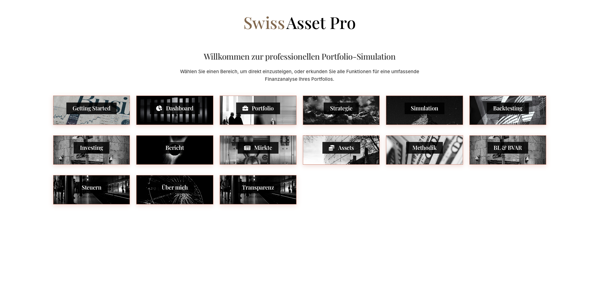
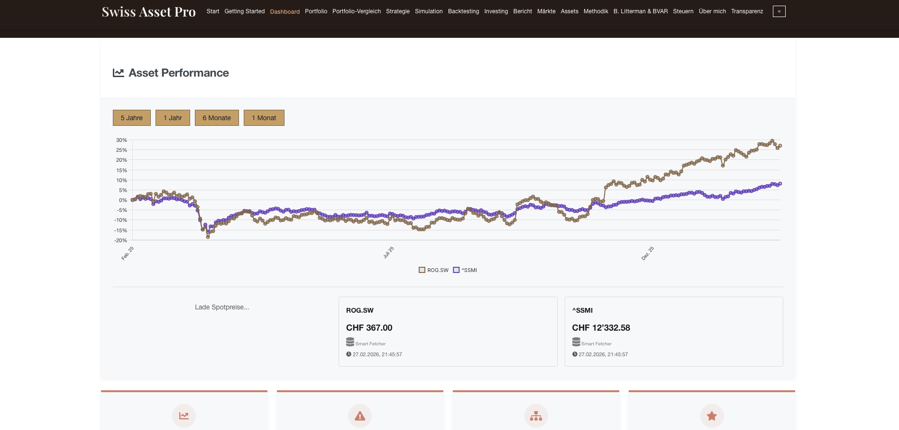
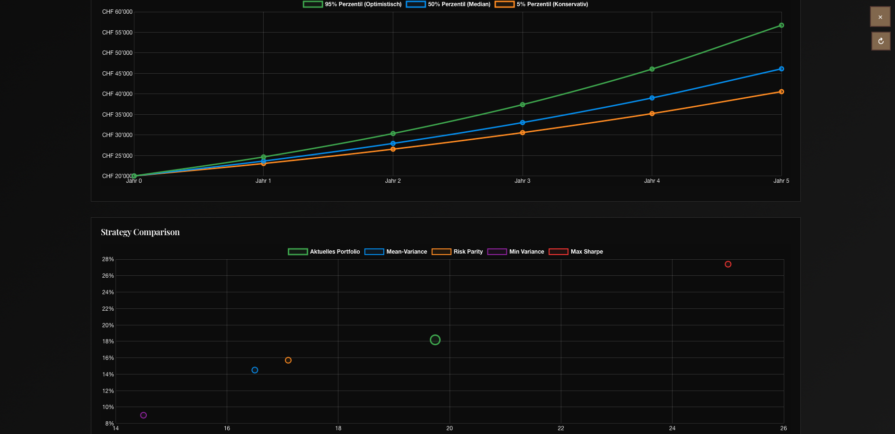
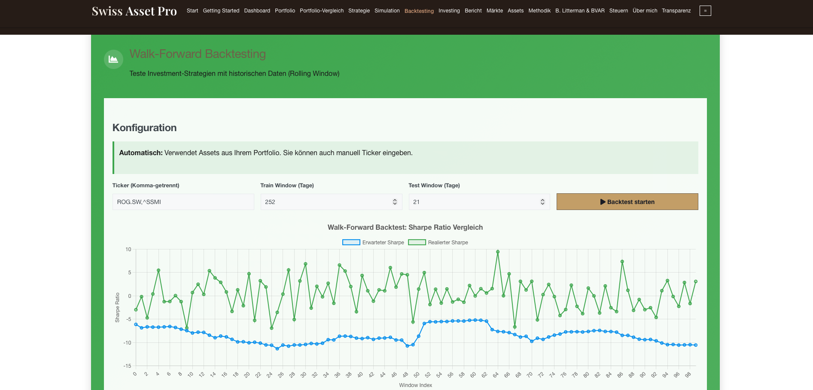

# Swiss Asset Pro

Professional Portfolio Analytics & Simulation Platform  
Developed by Ahmed Choudhary

---

## Overview

Swiss Asset Pro is a fully self-developed portfolio analytics platform designed to provide private investors with institutional-grade financial tools.

The project addresses a structural gap: advanced portfolio analytics are typically either expensive advisory services or complex institutional systems. Swiss Asset Pro provides a scalable, cost-efficient alternative.

---

## Key Capabilities

- Multi-asset portfolio construction (Swiss equities, international indices, commodities, crypto)
- Risk decomposition and performance attribution
- Monte Carlo simulation (percentile projections)
- Strategy comparison (Mean-Variance, Risk Parity, Max Sharpe, Min Variance)
- Walk-forward backtesting
- Live multi-source market data integration
- Swiss tax integration
- Automated analytical reporting

---

## Architecture

- Backend: Python (Flask)
- Data Processing: Pandas, NumPy, SciPy
- Optimization Models: Markowitz, Black-Litterman, BVAR
- Frontend: JavaScript, Chart.js
- Deployment: Docker-ready

---

## Application Screenshots

### Landing

### Dashboard

### Monte Carlo Simulation

### Walk-Forward Backtesting

---

## Technical Scope

- 30,000+ lines of modular code
- 400+ supported assets
- Multi-source data orchestration layer
- Automated validation & fallback logic
- Scalable backend architecture

---

_Data sources include publicly available market data APIs (e.g., Yahoo Finance, SNB, CoinGecko). No affiliation or endorsement implied._
